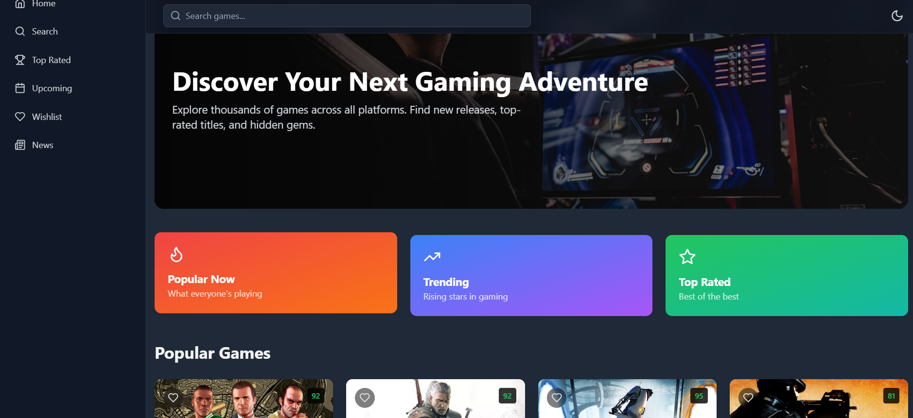
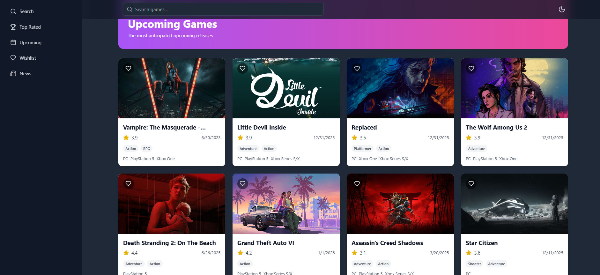
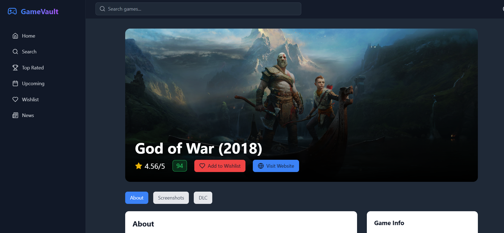
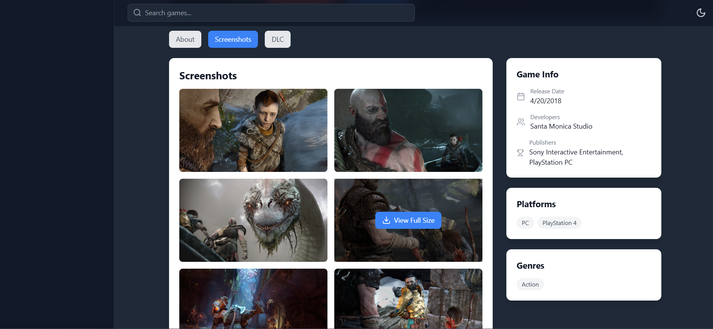

created with Vite + React + TS
## 🎯 **Live Demo**
🌍 [Check out the deployed site! using netlify](https://voluble-dasik-601e69.netlify.app/)  
🌍 [Check out the deployed site!](https://kingslayer458.github.io/Game-vault/)  


# 🎮 Game Vault

Welcome to **Game Vault** — a dynamic, responsive gaming wallpaper website powered by the **RAWG API**. Discover stunning game wallpapers and immerse yourself in the world of gaming visuals.

---

## 🚀 Features

✨ **Real-Time Wallpaper Fetching** — Get wallpapers from the latest and greatest games.

📱 **Fully Responsive** — Seamlessly adapts to desktops, tablets, and mobile devices.

⚡ **Smooth Animations** — Elegant transitions and hover effects for a rich UI experience.

🔎 **Search Functionality** — Find wallpapers by game titles instantly.

⭐ **Favorites** — Save your favorite wallpapers for quick access.

🌙 **Dark Mode Support** — Beautiful dark mode for nighttime browsing.

---

## 🎯 Tech Stack

- **HTML5**
- **CSS3** (with animations)
- **JavaScript (Vanilla)**
- **RAWG API** (for fetching game data)

---

## 📸 UI Preview






---

## 🛠️ Installation

1. **Clone the repository:**
   ```bash
   git clone https://github.com/kingslayer458/Game-vault.git
   ```

2. **Navigate to the project folder:**
   ```bash
   cd Game-vault
   ```


## 🔧 API Setup

1. Get your **RAWG API Key** from [RAWG.io](https://rawg.io/apidocs).

2. In `app.js`, replace `YOUR_API_KEY` with your actual API key:
   ```javascript
   const API_KEY = 'YOUR_API_KEY';
   ```

3. You're all set to fetch wallpapers!

---

## 📌 Future Enhancements

- 🎁 **User Accounts** — Save favorites persistently.
- 🔄 **Infinite Scroll** — Load more wallpapers on scroll.
- 🖼️ **Wallpaper Resolutions** — Choose between HD, 4K, and more.

---

## 🎉 Contributing

Contributions are welcome! Feel free to fork this repo, make changes, and submit a pull request.

---


## 🔥 Author

👑 **Kingslayer458** — Creator of **Game Vault**

✨ *Happy Gaming!* ✨

